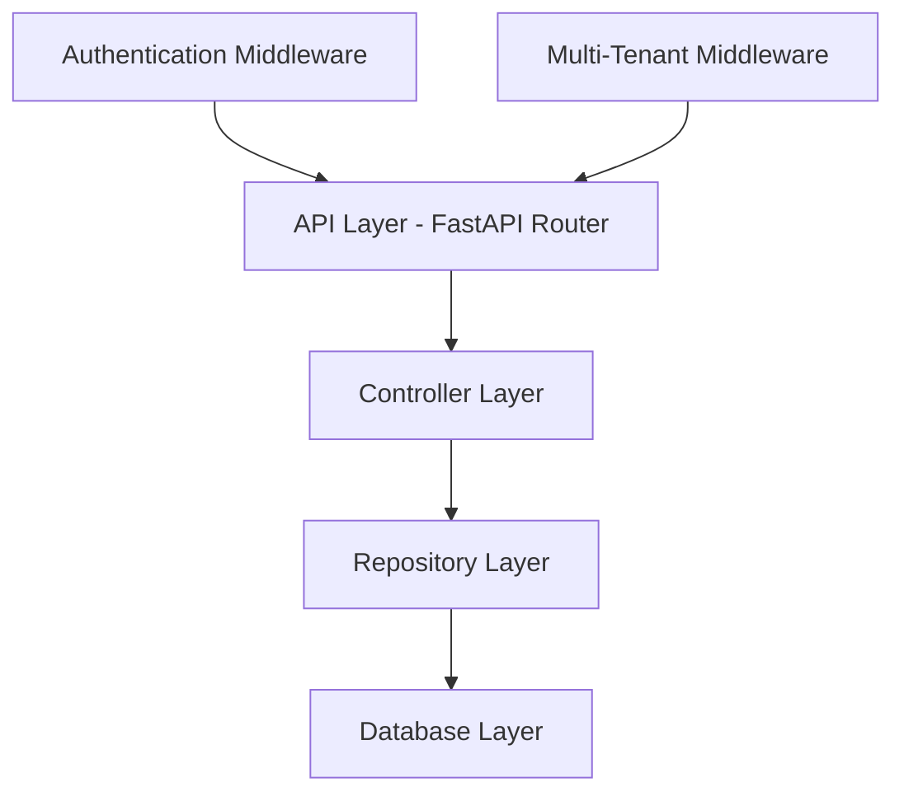

# Introduction

## Purpose and Scope

Taskeri is a feature-rich task management application designed to help organizations and teams manage their projects, tasks, teams, and resources efficiently. Built with a multi-tenant architecture, Taskeri allows different organizations to have their own isolated environment within the same application.

## Key Features

- **Multi-tenant Architecture**: Each organization has its own isolated database schema
- **Role-based Access Control**: Granular permission system for different user roles
- **Project Management**: Create and manage projects, assign team members
- **Task Management**: Create, assign, and track tasks with status, priority, and deadlines
- **Team Management**: Organize users into teams and departments
- **Time Tracking**: Log time spent on tasks and generate reports
- **Attendance Management**: Track employee check-ins and check-outs
- **Leave Management**: Request and approve leave
- **File Attachments**: Attach files to tasks and projects
- **Notifications**: System notifications for important events
- **Invoicing**: Generate and manage invoices

## Technology Stack

- **Backend**: FastAPI (Python)
- **Database**: MySQL with SQLAlchemy ORM
- **Authentication**: JWT (JSON Web Tokens)
- **Authorization**: Custom middleware for role-based access control
- **Migration**: Alembic

## System Requirements

- Python 3.8+
- MySQL 8.0+

## Backend Architecture

The Taskeri backend follows a clean architecture approach with the following layers:

This documentation focuses on the backend system of Taskeri, detailing the architecture, authentication and authorization mechanisms, API endpoints, and data models.