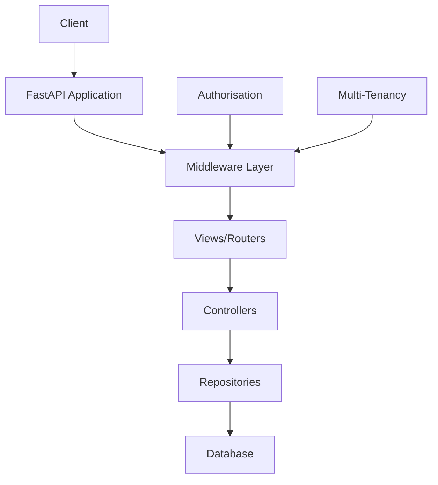
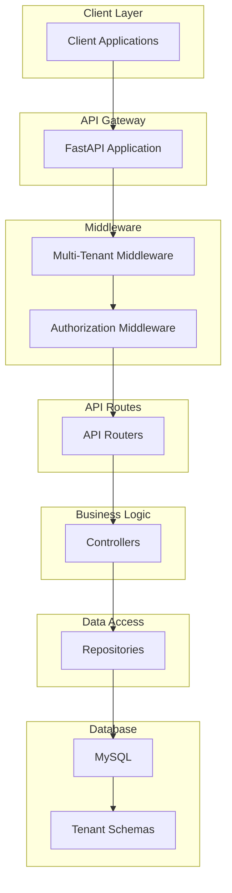

# Architecture Overview

## System Architecture

Taskeri follows a multi-layered architecture to ensure separation of concerns and maintainability. The backend is structured using the following layers:



## Component Diagram



## Layer Details

### API Gateway
FastAPI serves as the API gateway, handling HTTP requests and responses.

### Middleware Layer
- **Multi-Tenant Middleware**: Determines the tenant context based on the authenticated user
- **Authorization Middleware**: Enforces permission checks based on user roles

### Views/Routers Layer
API endpoints are organized by feature domains (tasks, users, projects, etc.).

### Controllers Layer
Implements business logic, input validation, and coordinates between repositories.

### Repositories Layer
Handles data access and persistence, isolating database operations.

### Database Layer
MySQL database with tenant-specific schemas for data isolation.

## Core Components

- **JWT Authentication**: Secures API endpoints using JSON Web Tokens
- **Role-Based Access Control**: Provides fine-grained permissions for different user roles
- **Multi-Tenant System**: Separates data for different organizations using database schemas
- **Database Migrations**: Uses Alembic for managing schema changes

## Directory Structure

```
app/
├── controllers/        # Business logic
├── middleware/         # Request handling middleware
├── models/             # SQLAlchemy models and DTOs
│   └── dtos/           # Data Transfer Objects
├── repositories/       # Data access layer
├── utils/              # Utility functions and helpers
├── views/              # API routes and endpoints
└── app.py              # Main application entry point
```

## Processing Flow

1. Client sends a request to the API
2. Request passes through middleware stack
   - Authentication validation
   - Tenant context establishment
   - Permission checking
3. Router directs request to appropriate controller
4. Controller applies business logic
5. Repository handles data operations
6. Response flows back through the layers to the client