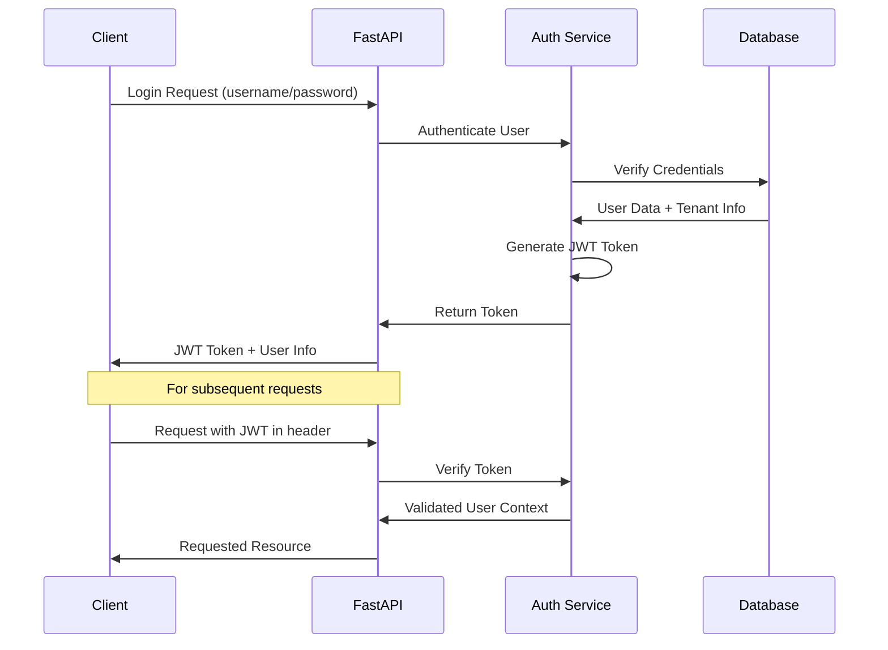
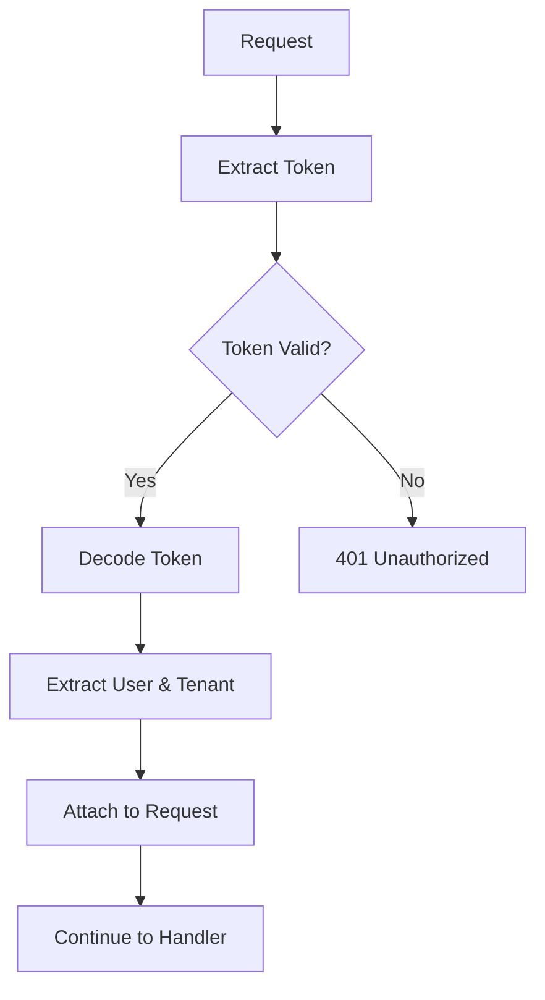

# Authentication System

## Overview

Taskeri implements a robust JWT (JSON Web Token) based authentication system to secure API endpoints. The authentication system handles user login, token generation, token validation, and session management.

## Authentication Flow



## JWT Structure

Taskeri's JWT tokens contain the following claims:

```json
{
  "sub": "user_id",
  "tenant": "tenant_schema_name",
  "user_id": 123,
  "email": "user@example.com",
  "role_ids": [1, 2],
  "exp": 1635399321,
  "iat": 1635312921
}
```

- `sub`: Subject (user ID)
- `tenant`: The tenant schema name for multi-tenancy
- `user_id`: User's numeric ID
- `email`: User's email address
- `role_ids`: Array of role IDs assigned to the user
- `exp`: Expiration timestamp
- `iat`: Issued at timestamp

## Authentication Middleware

The authentication middleware intercepts all requests to protected endpoints and validates the JWT token:

1. Extracts the token from the Authorization header
2. Verifies token validity and expiration
3. Extracts user and tenant information
4. Attaches user context to the request for downstream handlers

### Code Flow



## Login Process

1. User submits credentials (email/password)
2. The system validates credentials against the database
3. On successful authentication:
   - User information is retrieved
   - Tenant information is identified
   - JWT token is generated with appropriate claims
   - Token is returned to the client
4. On failed authentication:
   - 401 Unauthorized response is returned

## Authentication Implementation

Taskeri uses the following components for authentication:

- `auth_service.py`: Core service for token generation and validation
- `login_controller.py`: Handles the login process and credential validation
- `login_view.py`: Exposes the login endpoint
- JWT secret key stored in environment variables for security

## Security Considerations

- Passwords are hashed using secure algorithms
- Tokens have a configurable expiration time
- HTTPS is used for all communications
- Token secret keys are stored securely

## Related Files

- `/app/auth/auth_service.py` - Core authentication service
- `/app/controllers/login_controller.py` - Login business logic
- `/app/views/login_view.py` - Login API endpoint
- `/app/middleware/multi_tenant_middleware.py` - Token validation

## Public Routes

The following routes are public and do not require authentication:

```python
PUBLIC_ROUTES = [
    "/login", 
    "/register", 
    "/docs", 
    "/openapi.json", 
    "/token", 
    "/tenant-users/"
]
```

## Integration with Multi-Tenancy

Authentication and multi-tenancy are tightly integrated:

1. When a user logs in, their tenant information is included in the JWT token
2. The multi-tenant middleware extracts tenant information from the token
3. Database operations are executed in the context of the user's tenant

## Integration with Authorization

The authentication system sets the foundation for the authorization system:

1. User roles are included in the JWT token
2. The authorization middleware uses these roles to check permissions
3. API endpoints enforce role-based access control based on authenticated user information