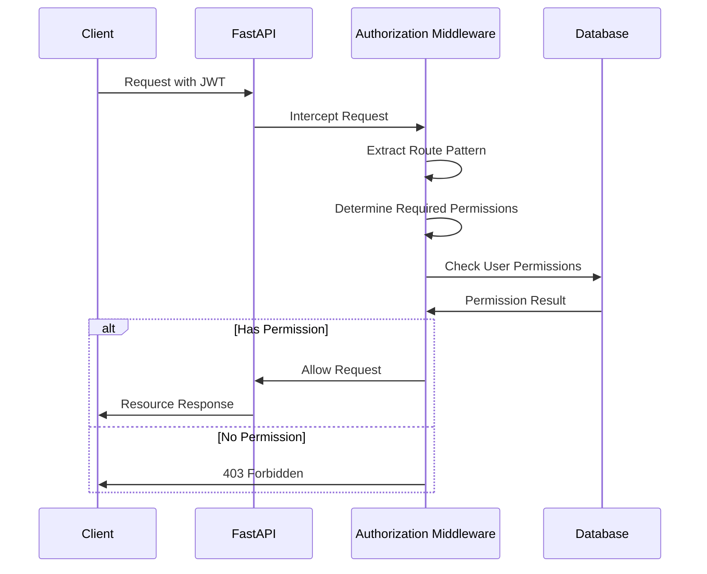
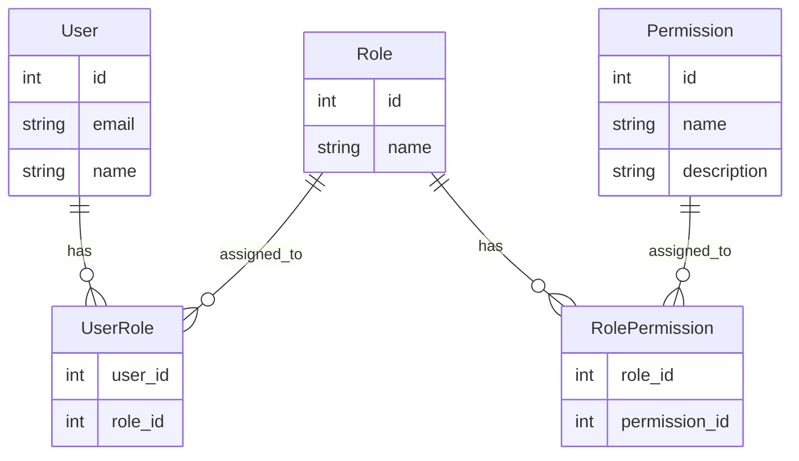
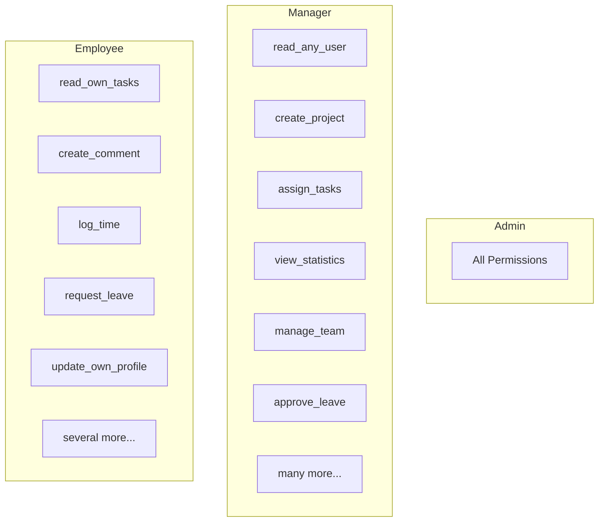
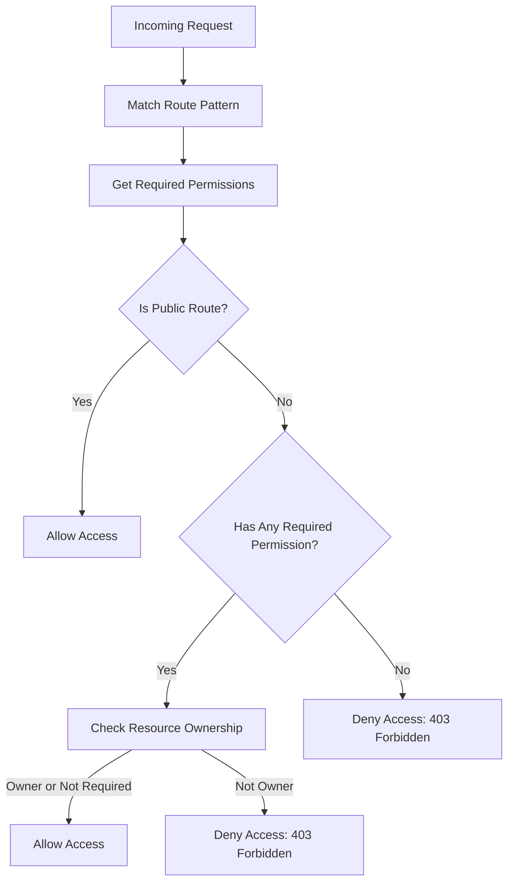

# Authorization System

## Overview

Taskeri implements a sophisticated role-based access control (RBAC) system that provides fine-grained permission management. The authorization system ensures that users can only access resources and perform actions they have permission for.

## Authorization Flow



## Permission Model

The permission system is based on a hierarchical model:



## Permission Types

Taskeri uses a naming convention for permissions that makes them intuitive and consistent:

- `create_[resource]`: Create a new resource
- `read_[resource]`: View a resource
- `update_[resource]`: Modify an existing resource
- `delete_[resource]`: Remove a resource
- `read_any_[resource]`: View any resource (not just owned)
- `update_any_[resource]`: Modify any resource (not just owned)
- `delete_any_[resource]`: Remove any resource (not just owned)

Examples:
- `create_task`
- `read_project`
- `update_own_profile`
- `delete_any_comment`
- `manage_user_roles`
- `view_statistics`

## Default Roles

The system comes with three predefined roles:

1. **Admin**: Full system access
2. **Manager**: Team and project management capabilities
3. **Employee**: Regular user with limited permissions



## Authorization Middleware

The `AuthorizationMiddleware` class is responsible for enforcing permissions:

1. Intercepts every request after authentication
2. Matches the request path against defined route patterns
3. Determines the required permissions for the HTTP method and route
4. Checks if the user has the necessary permissions
5. Allows or denies the request based on the permission check

## Route Permission Mapping

Routes are mapped to required permissions in the `app.py` file:

```python
ROUTE_PERMISSIONS = {
    # Task routes
    r"^/tasks$": {
        "GET": ["read_task"],
        "POST": ["create_task"]
    },
    r"^/tasks/\d+$": {
        "GET": ["read_task", "read_any_task"],
        "PUT": ["update_task", "update_any_task"],
        "DELETE": ["delete_own_task", "delete_any_task"]
    },
    # More routes...
}
```

Routes are defined using regex patterns to match URL paths, with HTTP methods mapped to required permissions.

## Resource Ownership

The authorization system also handles resource ownership checks. For example:

1. A user with `update_task` permission can only update tasks they own
2. A user with `update_any_task` permission can update any task
3. Ownership is determined based on the resource type (e.g., creator, assignee)

## Permission Checking Process



## Caching

For performance reasons, permission checks are cached in the database session to avoid repeated database queries during a single request.

## Permission Assignment

Permissions are assigned to roles, which are then assigned to users:

1. When a new tenant is created, default roles and permissions are created
2. Administrators can create new roles and assign permissions
3. Users are assigned roles through the user management interface

## Implementation Details

- Permission checks are implemented in the `AuthorizationMiddleware._check_permissions` method
- Regex patterns are used to match routes to permission requirements
- Permission cache uses a simple dictionary structure for fast lookups

## Related Files

- `/app/middleware/authorization_middleware.py` - Main authorization logic
- `/app/repositories/permission_repository.py` - Permission database operations
- `/app/models/permission.py` - Permission model
- `/app/models/role_permission.py` - Role-Permission relationship model
- `/app/app.py` - Route permission mappings