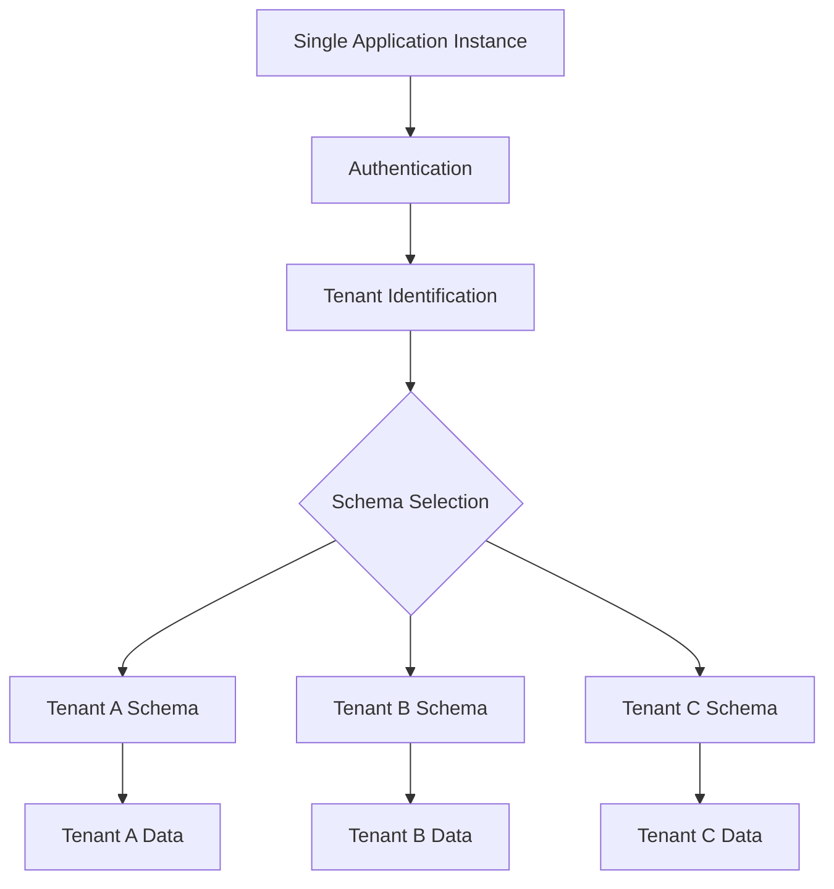
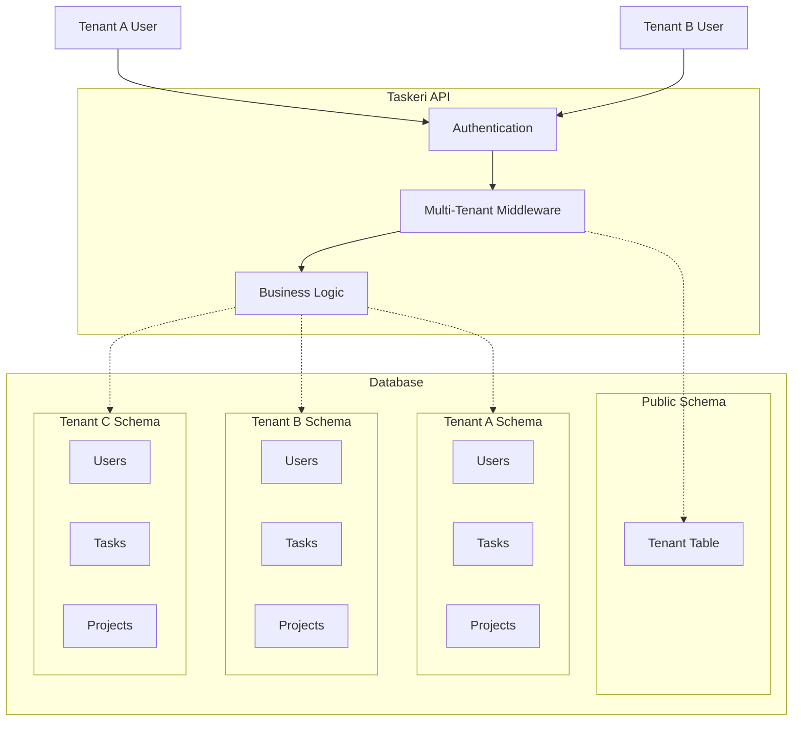
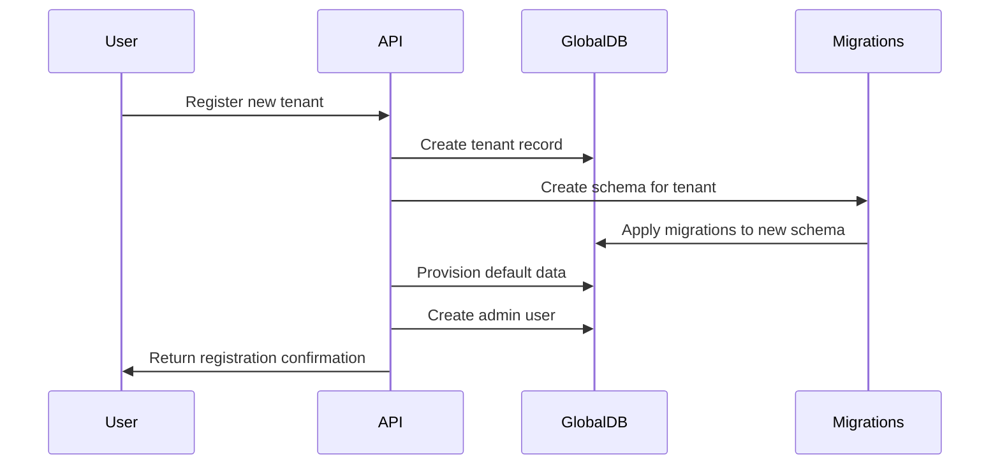
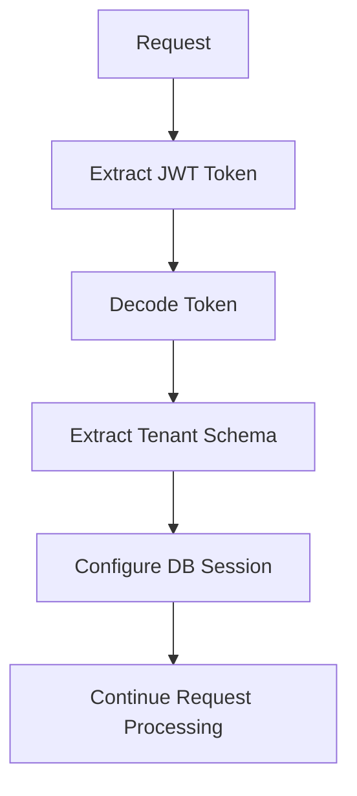
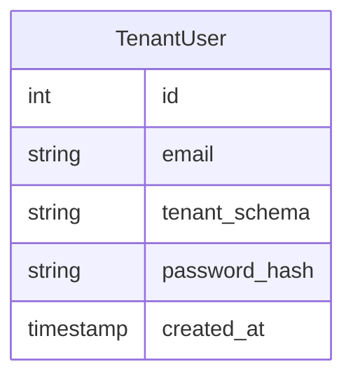
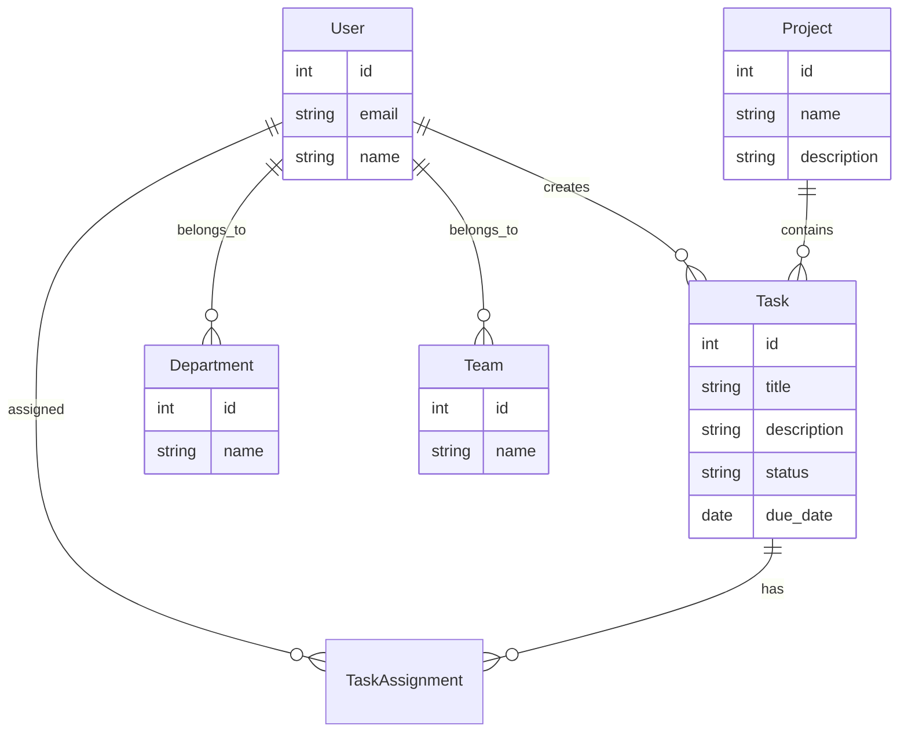

# Multi-Tenant Architecture

## Overview

Taskeri implements a multi-tenant architecture that allows multiple organizations to use the same application instance while keeping their data completely isolated. This is achieved through a database schema-per-tenant approach, where each tenant has its own database schema.

## Multi-Tenancy Model



## Tenant Isolation Architecture



## How It Works

### Tenant Registration

1. A new organization registers in the system
2. A new tenant entry is created in the global database
3. A new database schema is created for the tenant
4. Default data (roles, permissions) is provisioned for the tenant
5. Initial admin user is created for the tenant



### Tenant Identification

For each request:

1. User authenticates, receiving a JWT token with tenant information
2. Subsequent requests include the JWT token in the Authorization header
3. Multi-tenant middleware extracts tenant information from the token
4. Database session is configured to use the tenant's schema
5. All database operations are isolated to the tenant's schema

## Implementation Details

### Multi-Tenant Middleware

The `MultiTenantMiddleware` class:

1. Intercepts requests after authentication
2. Extracts tenant schema name from the JWT token
3. Configures the database session to use the tenant schema
4. Passes control to the next middleware or handler



### Schema Switching

The database connection dynamically switches schemas for each request:

1. Extract schema name from the JWT token
2. Use the `switch_schema` function to set the search path
3. All subsequent database operations use the selected schema

```python
def switch_schema(db: Session, schema_name: str):
    """Switch the current session to use the specified schema."""
    if schema_name:
        db.execute(text(f'SET search_path TO "{schema_name}"'))
    else:
        db.execute(text('SET search_path TO "public"'))
```

### Tenant Database Creation

When a new tenant is registered:

1. A new schema is created in the database
2. Alembic migrations are run to create all required tables
3. Default data is seeded (roles, permissions, etc.)

## Database Structure

### Global Database (Public Schema)

The public schema contains tenant metadata:



### Tenant-Specific Schema

Each tenant has a separate schema with all application tables:



## Advantages of the Multi-Tenant Approach

1. **Data Isolation**: Each tenant's data is completely isolated in its own schema
2. **Security**: Tenants cannot access each other's data
3. **Customization**: Each tenant can have its own set of roles and permissions
4. **Scalability**: The system can support many tenants without significant overhead
5. **Maintenance**: Database migrations can be applied per tenant as needed

## Related Files

- `/app/middleware/multi_tenant_middleware.py` - Multi-tenant middleware
- `/app/controllers/tenant_user_controller.py` - Tenant registration
- `/app/utils/db_utils.py` - Schema switching functions
- `/app/services/tenant_provisioning.py` - Tenant provisioning