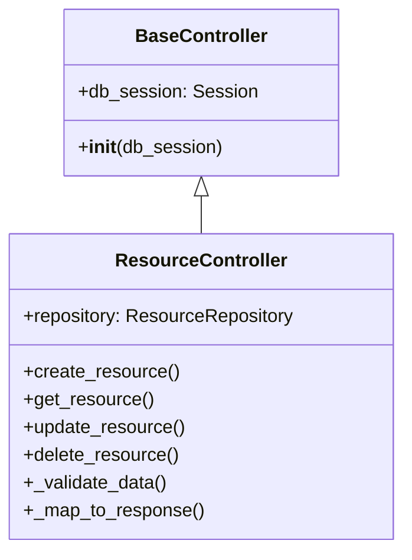
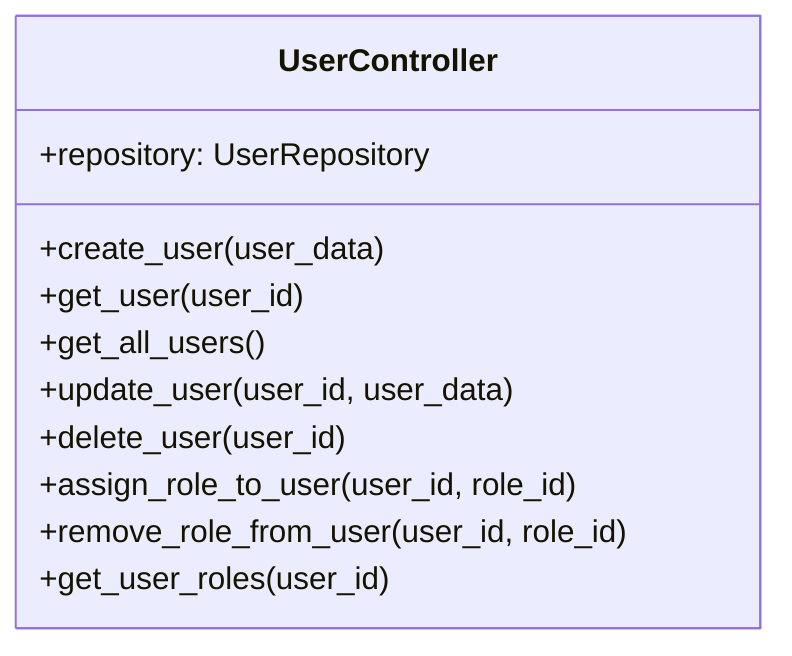
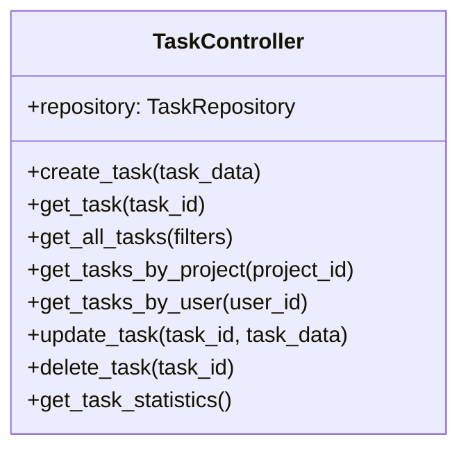
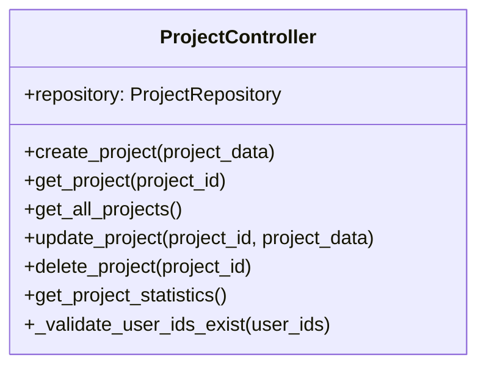
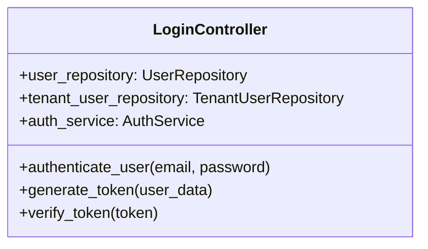
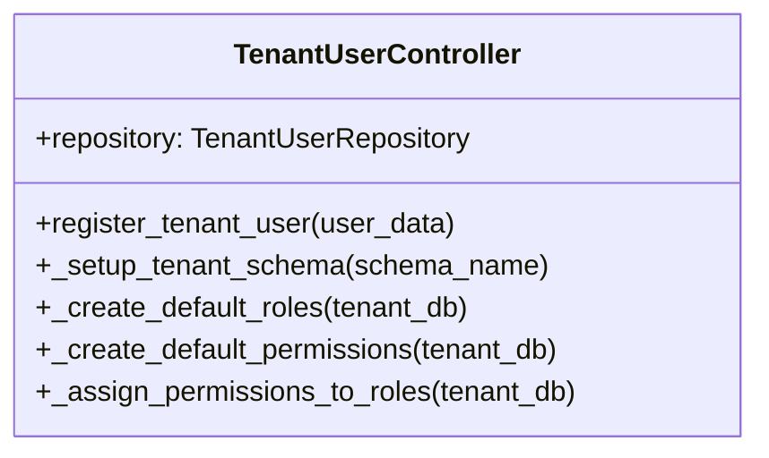

# Controllers

## Overview

Controllers in Taskeri implement the business logic of the application, acting as an intermediary between the API routes (views) and the data access layer (repositories). They handle request validation, orchestrate data operations, and enforce business rules.

## Controller Structure

Each controller follows a similar pattern:



## Key Controllers

### UserController

Manages user operations including creation, retrieval, updates, and role management.



Main responsibilities:
- User creation with password hashing
- User profile management
- User role assignment and removal
- User data validation

### TaskController

Handles task creation, assignment, updates, and queries.



Main responsibilities:
- Task creation and management
- Task assignment to users
- Task filtering and searching
- Task statistics calculation

### ProjectController

Manages projects, including creation, team assignment, and project metadata.



Main responsibilities:
- Project creation and management
- Project team assignment
- Project statistics calculation
- Data validation for project operations

### LoginController

Handles authentication and token generation.



Main responsibilities:
- User authentication
- Token generation and validation
- Multi-tenant user identification

### TenantUserController

Manages tenant registration and initial setup.



Main responsibilities:
- Tenant registration
- Schema creation
- Default data provisioning
- Initial user setup

## Common Controller Patterns

### Dependency Injection

Controllers typically receive dependencies through constructor injection:

```python
def __init__(self, db_session: Session = Depends(get_db)):
    self.repository = ResourceRepository(db_session)
```

### Data Validation

Controllers validate input data before processing:

```python
def _validate_data(self, data):
    # Validate data integrity
    if some_invalid_condition:
        raise HTTPException(
            status_code=status.HTTP_400_BAD_REQUEST,
            detail="Invalid data provided"
        )
```

### Response Mapping

Controllers map database entities to response DTOs:

```python
def _map_to_response(self, entity) -> ResponseDTO:
    return ResponseDTO(
        id=entity.id,
        name=entity.name,
        # Other fields
    )
```

### Error Handling

Controllers use try-except blocks for handling errors:

```python
try:
    # Operation that might fail
    result = self.repository.create_something(data)
    return self._map_to_response(result)
except SQLAlchemyError as e:
    # Database error handling
    raise HTTPException(
        status_code=status.HTTP_500_INTERNAL_SERVER_ERROR,
        detail=f"Database error: {str(e)}"
    )
except Exception as e:
    # General error handling
    raise HTTPException(
        status_code=status.HTTP_500_INTERNAL_SERVER_ERROR,
        detail=f"An unexpected error occurred: {str(e)}"
    )
```

## Controller Directory Structure

```
app/controllers/
├── __init__.py
├── attendance_controller.py
├── comment_controller.py
├── company_controller.py
├── department_controller.py
├── file_attachment_controller.py
├── invoice_controller.py
├── leave_request_controller.py
├── login_controller.py
├── notification_controller.py
├── permission_controller.py
├── project_controller.py
├── role_controller.py
├── role_permission_controller.py
├── task_controller.py
├── team_controller.py
├── tenant_user_controller.py
├── timelog_controller.py
└── user_controller.py
```

## Testing Controllers

Controllers are tested using unit tests with mocked repositories:

```python
@patch('app.repositories.user_repository.UserRepository.create_user')
def test_create_user(self, mock_create_user):
    # Setup mock
    mock_user = MagicMock()
    mock_create_user.return_value = mock_user
    
    # Test controller
    user_data = UserCreate(email="test@example.com", ...)
    response = self.user_controller.create_user(user_data)
    
    # Assert repository called correctly
    mock_create_user.assert_called_once_with(
        email="test@example.com",
        ...
    )
```