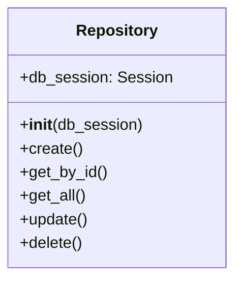
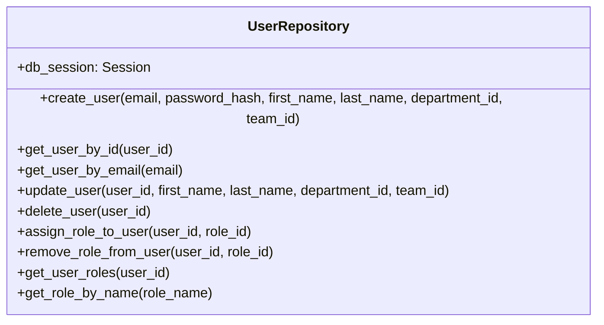
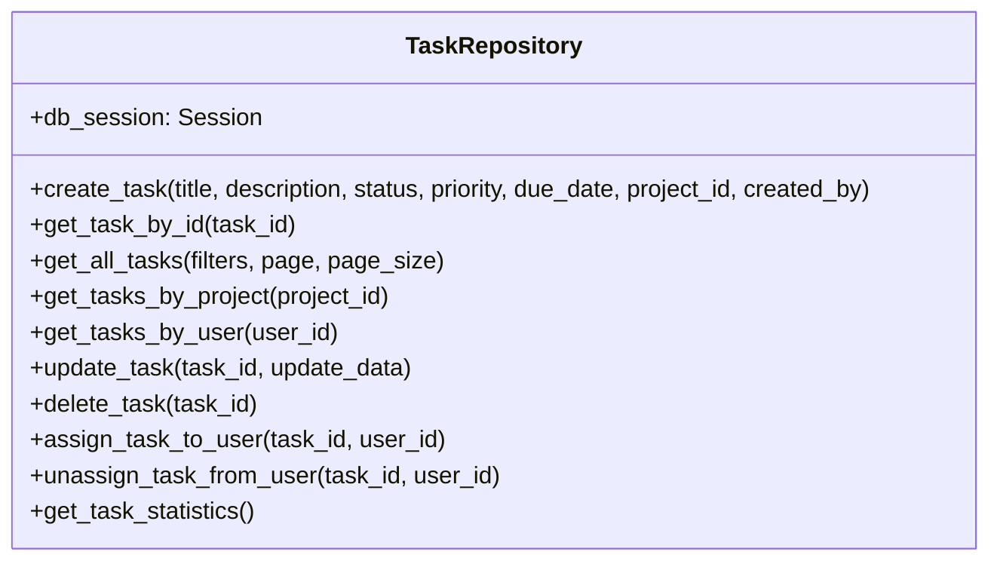
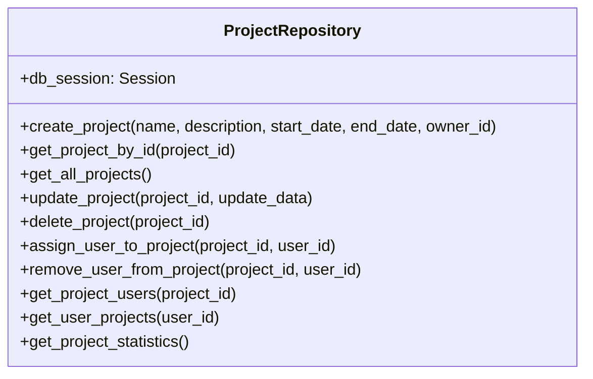
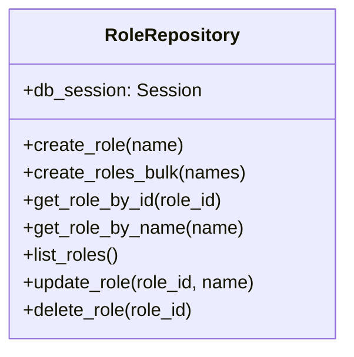
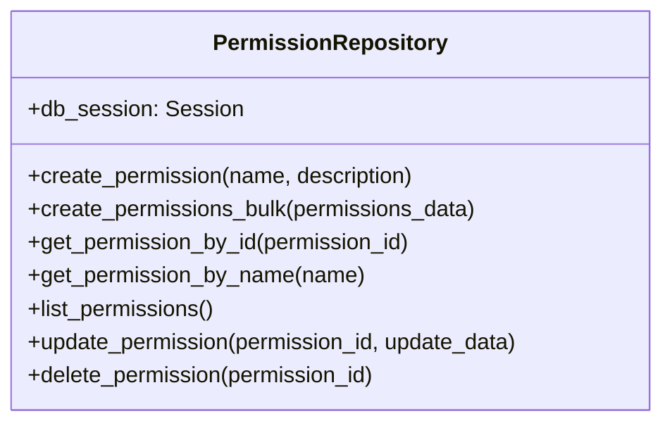
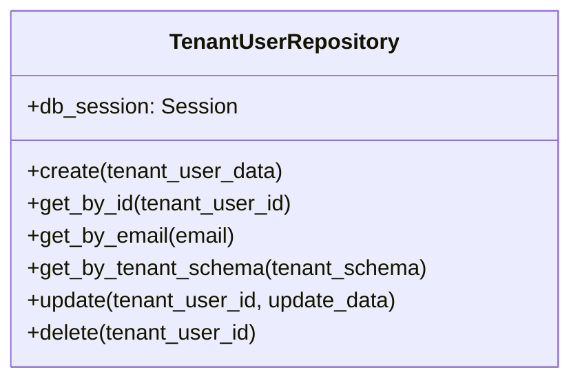

# Repositories

## Overview

Repositories in Taskeri form the data access layer, abstracting database operations from the business logic. Each repository is responsible for interacting with a specific database model, providing methods for creating, reading, updating, and deleting records.

## Repository Pattern



The repository pattern provides several benefits:
- Decouples business logic from data access concerns
- Makes code more testable by allowing repository mocking
- Centralizes data access logic in dedicated classes
- Enables consistent error handling for database operations

## Key Repositories

### UserRepository

Manages user data access, including role assignments.



### TaskRepository

Handles task data operations, including filtering and assignment.



### ProjectRepository

Manages project data and related operations.



### RoleRepository

Handles role data operations.



### PermissionRepository

Manages permission data operations.



### TenantUserRepository

Handles tenant user data in the global database.



## Common Repository Patterns

### Constructor

Repositories accept a database session in their constructor:

```python
def __init__(self, db_session: Session):
    self.db_session = db_session
```

### CRUD Operations

Basic CRUD operations follow a consistent pattern:

```python
# Create
def create_something(self, data1, data2):
    new_entity = Entity(field1=data1, field2=data2)
    self.db_session.add(new_entity)
    self.db_session.commit()
    self.db_session.refresh(new_entity)
    return new_entity

# Read
def get_something_by_id(self, entity_id):
    return self.db_session.query(Entity).filter(Entity.id == entity_id).first()

# Update
def update_something(self, entity_id, update_data):
    entity = self.get_something_by_id(entity_id)
    if entity:
        for key, value in update_data.items():
            setattr(entity, key, value)
        self.db_session.commit()
        self.db_session.refresh(entity)
    return entity

# Delete
def delete_something(self, entity_id):
    entity = self.get_something_by_id(entity_id)
    if entity:
        self.db_session.delete(entity)
        self.db_session.commit()
    return entity
```

### Query Optimization

Repositories use join operations to optimize queries:

```python
def get_task_with_assignments(self, task_id):
    return self.db_session.query(Task)\
        .options(
            joinedload(Task.assignments).joinedload(TaskAssignment.user)
        )\
        .filter(Task.id == task_id)\
        .first()
```

### Filtering and Pagination

Methods that return multiple records often include filtering and pagination:

```python
def get_filtered_tasks(self, filters=None, page=1, page_size=20):
    query = self.db_session.query(Task)
    
    # Apply filters
    if filters:
        if filters.status:
            query = query.filter(Task.status.in_(filters.status))
        if filters.priority:
            query = query.filter(Task.priority.in_(filters.priority))
        # ...more filters
    
    # Apply pagination
    total = query.count()
    tasks = query.offset((page - 1) * page_size).limit(page_size).all()
    
    return {
        "items": tasks,
        "total": total,
        "page": page,
        "page_size": page_size,
        "pages": (total + page_size - 1) // page_size
    }
```

### Error Handling

Repositories use SQLAlchemy's exception handling:

```python
def create_with_error_handling(self, data):
    try:
        new_entity = Entity(**data)
        self.db_session.add(new_entity)
        self.db_session.commit()
        self.db_session.refresh(new_entity)
        return new_entity
    except SQLAlchemyError as e:
        self.db_session.rollback()
        # Let controller handle specific error
        raise e
```

## Repository Directory Structure

```
app/repositories/
├── __init__.py
├── attendance_repository.py
├── comment_repository.py
├── company_repository.py
├── department_repository.py
├── file_attachment_repository.py
├── invoice_repository.py
├── leave_request_repository.py
├── notification_repository.py
├── permission_repository.py
├── project_repository.py
├── role_permission_repository.py
├── role_repository.py
├── task_repository.py
├── team_repository.py
├── tenant_user_repository.py
├── timelog_repository.py
└── user_repository.py
```

## Testing Repositories

Repository tests typically require a test database:

```python
def test_create_user():
    # Setup test DB session
    engine = create_engine('sqlite:///:memory:')
    Base.metadata.create_all(engine)
    Session = sessionmaker(bind=engine)
    session = Session()
    
    # Test repository
    repo = UserRepository(session)
    user = repo.create_user(
        email="test@example.com",
        password_hash="hashed_password",
        first_name="Test",
        last_name="User",
        department_id=None,
        team_id=None
    )
    
    # Assertions
    assert user.email == "test@example.com"
    assert user.first_name == "Test"
    
    # Check database state
    db_user = session.query(User).filter(User.email == "test@example.com").first()
    assert db_user is not None
    assert db_user.id == user.id
```