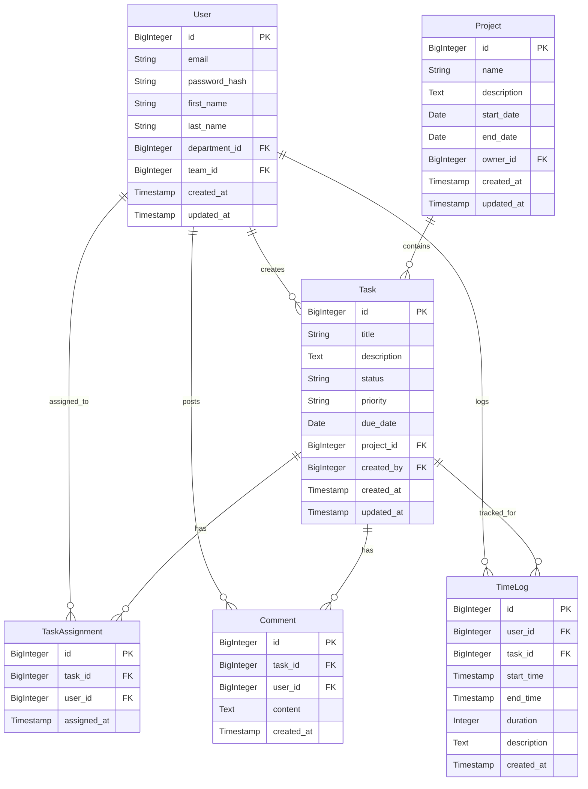

# Models

## Overview

Models in Taskeri represent the database schema and define the structure of data stored in the application. The system uses SQLAlchemy ORM (Object-Relational Mapping) to map Python classes to database tables, providing type safety and object-oriented access to data.

## Model Architecture

Taskeri uses two types of models:

1. **Database Models**: SQLAlchemy ORM classes that map directly to database tables
2. **Data Transfer Objects (DTOs)**: Pydantic models for request/response validation and serialization


## Database Models

### Core Models



### Organization Models


### Authorization Models


### Other Models


### Multi-Tenant Model


## Data Transfer Objects (DTOs)

DTOs are Pydantic models used for request validation, response serialization, and data transfer between layers.

### Example DTO Structure

```python
# Base DTO
class TaskBase(BaseModel):
    title: str
    description: Optional[str] = None
    status: str
    priority: str
    due_date: Optional[date] = None
    project_id: int

# Create DTO (used for POST requests)
class TaskCreate(TaskBase):
    assigned_to: Optional[List[int]] = None

# Update DTO (used for PUT requests)
class TaskUpdate(BaseModel):
    title: Optional[str] = None
    description: Optional[str] = None
    status: Optional[str] = None
    priority: Optional[str] = None
    due_date: Optional[date] = None
    project_id: Optional[int] = None
    assigned_to: Optional[List[int]] = None

# Response DTO (returned from API)
class TaskResponse(TaskBase):
    id: int
    created_by: int
    created_at: str
    updated_at: str
    
    class Config:
        orm_mode = True
        from_attributes = True
    
    @validator('created_at', 'updated_at', pre=True)
    def format_datetime(cls, v):
        if isinstance(v, datetime):
            return v.isoformat()
        return v
```

## SQLAlchemy Model Example

```python
class Task(Base):
    __tablename__ = "tasks"
    __table_args__ = {"schema": None}  # Schema set dynamically
    
    id = Column(BigInteger, primary_key=True)
    title = Column(String(255), nullable=False)
    description = Column(Text)
    status = Column(String(50), nullable=False)
    priority = Column(String(50), nullable=False)
    due_date = Column(Date)
    project_id = Column(BigInteger, ForeignKey("projects.id", ondelete="CASCADE"))
    created_by = Column(BigInteger, ForeignKey("users.id", ondelete="SET NULL"))
    created_at = Column(TIMESTAMP, server_default=func.now())
    updated_at = Column(TIMESTAMP, server_default=func.now(), onupdate=func.now())
    
    # Relationships
    project = relationship("Project", back_populates="tasks")
    creator = relationship("User", foreign_keys=[created_by])
    assignments = relationship("TaskAssignment", back_populates="task", cascade="all, delete-orphan")
    comments = relationship("Comment", back_populates="task", cascade="all, delete-orphan")
    attachments = relationship("FileAttachment", back_populates="task", cascade="all, delete-orphan")
    time_logs = relationship("TimeLog", back_populates="task", cascade="all, delete-orphan")
```

## Model Directory Structure

```
app/models/
├── __init__.py
├── activity_log.py
├── attendance.py
├── comment.py
├── company.py
├── department.py
├── dtos/
│   ├── __init__.py
│   ├── attendance_dtos.py
│   ├── company_dtos.py
│   ├── department_dtos.py
│   ├── file_attachment_dtos.py
│   ├── invoice_dtos.py
│   ├── leave_request_dtos.py
│   ├── notification_dtos.py
│   ├── permission_dtos.py
│   ├── project_dtos.py
│   ├── role_dtos.py
│   ├── role_permission_dto.py
│   ├── task_dtos.py
│   ├── team_dtos.py
│   ├── tenant_user_dtos.py
│   ├── timelog_dtos.py
│   └── user_dtos.py
├── file_attachment.py
├── invoice.py
├── leave_request.py
├── notification.py
├── permission.py
├── project.py
├── role.py
├── role_permission.py
├── task.py
├── task_assignment.py
├── team.py
├── tenant.py
├── tenant_user.py
├── time_log.py
├── user.py
└── user_role.py
```

## Model Usage Patterns

### Model Creation

```python
# Creating a new database model instance
new_user = User(
    email="user@example.com",
    password_hash="hashed_password",
    first_name="John",
    last_name="Doe"
)
db_session.add(new_user)
db_session.commit()
db_session.refresh(new_user)
```

### DTO Validation

```python
# Validating request data with DTOs
try:
    user_data = UserCreate(
        email="user@example.com",
        password="password123",
        first_name="John",
        last_name="Doe"
    )
    # Data is validated according to DTO rules
except ValidationError as e:
    # Handle validation errors
    print(e.errors())
```

### DTO to Model Conversion

```python
# Converting DTO to database model
def create_user(user_data: UserCreate):
    hashed_password = hash_password(user_data.password)
    
    user = User(
        email=user_data.email,
        password_hash=hashed_password,
        first_name=user_data.first_name,
        last_name=user_data.last_name,
        department_id=user_data.department_id,
        team_id=user_data.team_id
    )
    
    return user
```

### Model to DTO Conversion

```python
# Converting database model to response DTO
def map_to_response(user: User) -> UserResponse:
    return UserResponse.from_orm(user)  # Using Pydantic's from_orm
```