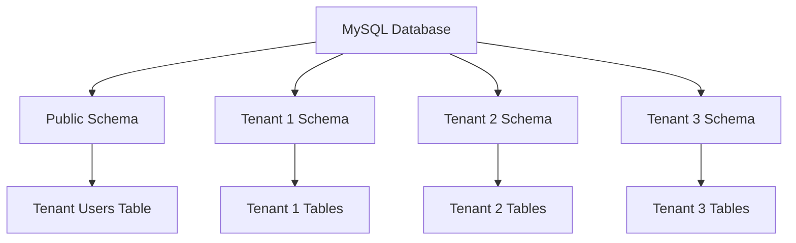

# Database Schema

## Overview

Taskeri uses a multi-tenant database architecture with MySQL. Each tenant has its own schema containing a complete set of application tables, providing full data isolation between organizations. The public schema contains only tenant metadata.

## Schema Architecture



## Global Schema

The public schema contains only tenant information:

```sql
CREATE TABLE tenant_users (
    id BIGINT PRIMARY KEY AUTO_INCREMENT,
    email VARCHAR(255) NOT NULL UNIQUE,
    tenant_schema VARCHAR(100) NOT NULL UNIQUE,
    password_hash VARCHAR(255) NOT NULL,
    created_at TIMESTAMP DEFAULT CURRENT_TIMESTAMP
);
```

## Tenant Schema

Each tenant schema contains a full set of application tables:

### Core Tables

```sql
-- Users Table
CREATE TABLE users (
    id BIGINT PRIMARY KEY AUTO_INCREMENT,
    email VARCHAR(255) NOT NULL UNIQUE,
    password_hash VARCHAR(255) NOT NULL,
    first_name VARCHAR(100) NOT NULL,
    last_name VARCHAR(100) NOT NULL,
    department_id BIGINT,
    team_id BIGINT,
    created_at TIMESTAMP DEFAULT CURRENT_TIMESTAMP,
    updated_at TIMESTAMP DEFAULT CURRENT_TIMESTAMP ON UPDATE CURRENT_TIMESTAMP,
    FOREIGN KEY (department_id) REFERENCES departments(id) ON DELETE SET NULL,
    FOREIGN KEY (team_id) REFERENCES teams(id) ON DELETE SET NULL
);

-- Projects Table
CREATE TABLE projects (
    id BIGINT PRIMARY KEY AUTO_INCREMENT,
    name VARCHAR(255) NOT NULL,
    description TEXT,
    start_date DATE,
    end_date DATE,
    owner_id BIGINT,
    created_at TIMESTAMP DEFAULT CURRENT_TIMESTAMP,
    updated_at TIMESTAMP DEFAULT CURRENT_TIMESTAMP ON UPDATE CURRENT_TIMESTAMP,
    FOREIGN KEY (owner_id) REFERENCES users(id) ON DELETE SET NULL
);

-- Tasks Table
CREATE TABLE tasks (
    id BIGINT PRIMARY KEY AUTO_INCREMENT,
    title VARCHAR(255) NOT NULL,
    description TEXT,
    status VARCHAR(50) NOT NULL,
    priority VARCHAR(50) NOT NULL,
    due_date DATE,
    project_id BIGINT,
    created_by BIGINT,
    created_at TIMESTAMP DEFAULT CURRENT_TIMESTAMP,
    updated_at TIMESTAMP DEFAULT CURRENT_TIMESTAMP ON UPDATE CURRENT_TIMESTAMP,
    FOREIGN KEY (project_id) REFERENCES projects(id) ON DELETE CASCADE,
    FOREIGN KEY (created_by) REFERENCES users(id) ON DELETE SET NULL
);

-- Task Assignments Table
CREATE TABLE task_assignments (
    id BIGINT PRIMARY KEY AUTO_INCREMENT,
    task_id BIGINT NOT NULL,
    user_id BIGINT NOT NULL,
    assigned_at TIMESTAMP DEFAULT CURRENT_TIMESTAMP,
    FOREIGN KEY (task_id) REFERENCES tasks(id) ON DELETE CASCADE,
    FOREIGN KEY (user_id) REFERENCES users(id) ON DELETE CASCADE,
    UNIQUE (task_id, user_id)
);

-- Comments Table
CREATE TABLE comments (
    id BIGINT PRIMARY KEY AUTO_INCREMENT,
    task_id BIGINT NOT NULL,
    user_id BIGINT NOT NULL,
    content TEXT NOT NULL,
    created_at TIMESTAMP DEFAULT CURRENT_TIMESTAMP,
    FOREIGN KEY (task_id) REFERENCES tasks(id) ON DELETE CASCADE,
    FOREIGN KEY (user_id) REFERENCES users(id) ON DELETE CASCADE
);

-- Time Logs Table
CREATE TABLE time_logs (
    id BIGINT PRIMARY KEY AUTO_INCREMENT,
    user_id BIGINT NOT NULL,
    task_id BIGINT NOT NULL,
    start_time TIMESTAMP NOT NULL,
    end_time TIMESTAMP,
    duration INT,
    description TEXT,
    created_at TIMESTAMP DEFAULT CURRENT_TIMESTAMP,
    FOREIGN KEY (user_id) REFERENCES users(id) ON DELETE CASCADE,
    FOREIGN KEY (task_id) REFERENCES tasks(id) ON DELETE CASCADE
);
```

### Organization Tables

```sql
-- Companies Table
CREATE TABLE companies (
    id BIGINT PRIMARY KEY AUTO_INCREMENT,
    name VARCHAR(255) NOT NULL,
    description TEXT,
    contact_email VARCHAR(255),
    contact_phone VARCHAR(50),
    created_at TIMESTAMP DEFAULT CURRENT_TIMESTAMP,
    updated_at TIMESTAMP DEFAULT CURRENT_TIMESTAMP ON UPDATE CURRENT_TIMESTAMP
);

-- Departments Table
CREATE TABLE departments (
    id BIGINT PRIMARY KEY AUTO_INCREMENT,
    name VARCHAR(255) NOT NULL,
    company_id BIGINT NOT NULL,
    created_at TIMESTAMP DEFAULT CURRENT_TIMESTAMP,
    updated_at TIMESTAMP DEFAULT CURRENT_TIMESTAMP ON UPDATE CURRENT_TIMESTAMP,
    FOREIGN KEY (company_id) REFERENCES companies(id) ON DELETE CASCADE
);

-- Teams Table
CREATE TABLE teams (
    id BIGINT PRIMARY KEY AUTO_INCREMENT,
    name VARCHAR(255) NOT NULL,
    description TEXT,
    lead_id BIGINT,
    created_at TIMESTAMP DEFAULT CURRENT_TIMESTAMP,
    updated_at TIMESTAMP DEFAULT CURRENT_TIMESTAMP ON UPDATE CURRENT_TIMESTAMP,
    FOREIGN KEY (lead_id) REFERENCES users(id) ON DELETE SET NULL
);
```

### Authorization Tables

```sql
-- Roles Table
CREATE TABLE roles (
    id BIGINT PRIMARY KEY AUTO_INCREMENT,
    name VARCHAR(100) NOT NULL UNIQUE,
    created_at TIMESTAMP DEFAULT CURRENT_TIMESTAMP,
    updated_at TIMESTAMP DEFAULT CURRENT_TIMESTAMP ON UPDATE CURRENT_TIMESTAMP
);

-- Permissions Table
CREATE TABLE permissions (
    id BIGINT PRIMARY KEY AUTO_INCREMENT,
    name VARCHAR(100) NOT NULL UNIQUE,
    description TEXT,
    created_at TIMESTAMP DEFAULT CURRENT_TIMESTAMP,
    updated_at TIMESTAMP DEFAULT CURRENT_TIMESTAMP ON UPDATE CURRENT_TIMESTAMP
);

-- User Roles Table
CREATE TABLE user_roles (
    id BIGINT PRIMARY KEY AUTO_INCREMENT,
    user_id BIGINT NOT NULL,
    role_id BIGINT NOT NULL,
    created_at TIMESTAMP DEFAULT CURRENT_TIMESTAMP,
    FOREIGN KEY (user_id) REFERENCES users(id) ON DELETE CASCADE,
    FOREIGN KEY (role_id) REFERENCES roles(id) ON DELETE CASCADE,
    UNIQUE (user_id, role_id)
);

-- Role Permissions Table
CREATE TABLE role_permissions (
    id BIGINT PRIMARY KEY AUTO_INCREMENT,
    role_id BIGINT NOT NULL,
    permission_id BIGINT NOT NULL,
    created_at TIMESTAMP DEFAULT CURRENT_TIMESTAMP,
    FOREIGN KEY (role_id) REFERENCES roles(id) ON DELETE CASCADE,
    FOREIGN KEY (permission_id) REFERENCES permissions(id) ON DELETE CASCADE,
    UNIQUE (role_id, permission_id)
);
```

### Other Tables

```sql
-- Attendance Table
CREATE TABLE attendance (
    id BIGINT PRIMARY KEY AUTO_INCREMENT,
    user_id BIGINT NOT NULL,
    check_in TIMESTAMP NOT NULL,
    check_out TIMESTAMP,
    FOREIGN KEY (user_id) REFERENCES users(id) ON DELETE CASCADE
);

-- Leave Requests Table
CREATE TABLE leave_requests (
    id BIGINT PRIMARY KEY AUTO_INCREMENT,
    user_id BIGINT NOT NULL,
    start_date DATE NOT NULL,
    end_date DATE NOT NULL,
    leave_type VARCHAR(50) NOT NULL,
    status VARCHAR(50) NOT NULL DEFAULT 'pending',
    reason TEXT,
    created_at TIMESTAMP DEFAULT CURRENT_TIMESTAMP,
    updated_at TIMESTAMP DEFAULT CURRENT_TIMESTAMP ON UPDATE CURRENT_TIMESTAMP,
    FOREIGN KEY (user_id) REFERENCES users(id) ON DELETE CASCADE
);

-- File Attachments Table
CREATE TABLE file_attachments (
    id BIGINT PRIMARY KEY AUTO_INCREMENT,
    task_id BIGINT NOT NULL,
    file_path VARCHAR(255) NOT NULL,
    uploaded_at TIMESTAMP DEFAULT CURRENT_TIMESTAMP,
    FOREIGN KEY (task_id) REFERENCES tasks(id) ON DELETE CASCADE
);

-- Activity Logs Table
CREATE TABLE activity_logs (
    id BIGINT PRIMARY KEY AUTO_INCREMENT,
    user_id BIGINT NOT NULL,
    action TEXT NOT NULL,
    timestamp TIMESTAMP DEFAULT CURRENT_TIMESTAMP,
    FOREIGN KEY (user_id) REFERENCES users(id) ON DELETE CASCADE
);

-- Invoices Table
CREATE TABLE invoices (
    id BIGINT PRIMARY KEY AUTO_INCREMENT,
    company_id BIGINT NOT NULL,
    amount DECIMAL(10, 2) NOT NULL,
    currency VARCHAR(3) NOT NULL DEFAULT 'USD',
    issue_date DATE NOT NULL,
    due_date DATE NOT NULL,
    status VARCHAR(50) NOT NULL DEFAULT 'pending',
    created_at TIMESTAMP DEFAULT CURRENT_TIMESTAMP,
    updated_at TIMESTAMP DEFAULT CURRENT_TIMESTAMP ON UPDATE CURRENT_TIMESTAMP,
    FOREIGN KEY (company_id) REFERENCES companies(id) ON DELETE CASCADE
);

-- Project Users Table (for many-to-many relationship)
CREATE TABLE project_users (
    project_id BIGINT NOT NULL,
    user_id BIGINT NOT NULL,
    assigned_at TIMESTAMP DEFAULT CURRENT_TIMESTAMP,
    PRIMARY KEY (project_id, user_id),
    FOREIGN KEY (project_id) REFERENCES projects(id) ON DELETE CASCADE,
    FOREIGN KEY (user_id) REFERENCES users(id) ON DELETE CASCADE
);
```

## Indexes

```sql
-- User indexes
CREATE INDEX idx_users_email ON users(email);
CREATE INDEX idx_users_department ON users(department_id);
CREATE INDEX idx_users_team ON users(team_id);

-- Task indexes
CREATE INDEX idx_tasks_status ON tasks(status);
CREATE INDEX idx_tasks_priority ON tasks(priority);
CREATE INDEX idx_tasks_due_date ON tasks(due_date);
CREATE INDEX idx_tasks_project ON tasks(project_id);
CREATE INDEX idx_tasks_created_by ON tasks(created_by);

-- Comment indexes
CREATE INDEX idx_comments_task ON comments(task_id);
CREATE INDEX idx_comments_user ON comments(user_id);

-- Time log indexes
CREATE INDEX idx_time_logs_user ON time_logs(user_id);
CREATE INDEX idx_time_logs_task ON time_logs(task_id);
CREATE INDEX idx_time_logs_start_time ON time_logs(start_time);

-- Attendance indexes
CREATE INDEX idx_attendance_user ON attendance(user_id);
CREATE INDEX idx_attendance_check_in ON attendance(check_in);

-- Leave request indexes
CREATE INDEX idx_leave_requests_user ON leave_requests(user_id);
CREATE INDEX idx_leave_requests_dates ON leave_requests(start_date, end_date);
CREATE INDEX idx_leave_requests_status ON leave_requests(status);
```

## Database Schema Evolution

Taskeri uses Alembic for managing database schema migrations:

```
alembic/
├── env.py               # Migration environment setup
├── README              # Migration documentation
├── script.py.mako      # Template for migration files
└── versions/           # Migration versions
    ├── 001_initial.py
    ├── 002_add_teams.py
    ├── 003_add_comments.py
    └── ...
```

## Schema Creation Process

When a new tenant is registered:

1. A new schema is created in the database
2. Alembic runs all migrations to create the schema tables
3. Default data is seeded (roles, permissions, etc.)

```python
def create_tenant_schema(schema_name):
    # Create schema
    db.execute(text(f'CREATE SCHEMA IF NOT EXISTS "{schema_name}"'))
    
    # Switch to schema
    db.execute(text(f'SET search_path TO "{schema_name}"'))
    
    # Run migrations
    subprocess.run(["alembic", "-x", f"schema={schema_name}", "upgrade", "head"])
    
    # Seed default data
    seed_default_data(db, schema_name)
```

## Schema per Tenant Strategy

The schema-per-tenant approach provides several benefits:

1. **Data Isolation**: Each tenant's data is completely isolated
2. **Security**: No possibility of data leakage between tenants
3. **Customization**: Schemas can be customized per tenant if needed
4. **Performance**: Smaller tables per tenant, better query performance
5. **Maintenance**: Can backup, restore, or migrate tenant data independently